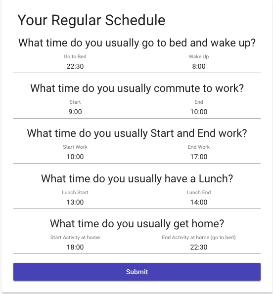
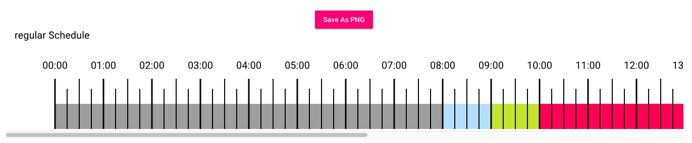
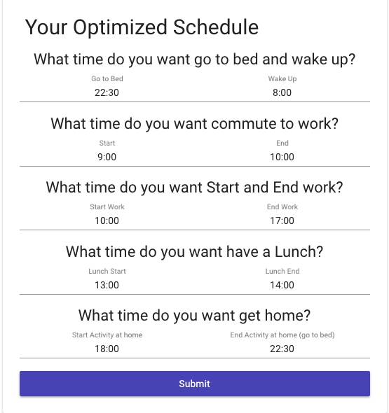
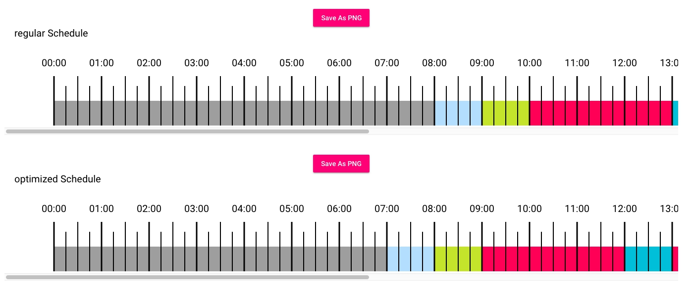

# 12 - Dev Challenge

My solution from [DevChallenge 12](https://devchallenge.it/about/) [Front End Round 1](https://devchallenge.it/wp-content/uploads/sites/2/2018/05/r1_frontend_js_pro.pdf)  

## Installation

Firs of all check your need to install latest version of `Node` and `NPM`.
- `npm install` - install all decencies;
- `npm start` - run development server with production optimization `http://localhost:4200/`

## Build

Run `npm run build` to build the project.

Output files in `dist` directory

The Size of the builded project ~ `983 KB`

## Project Architecture

- `src` - contain all source code of application
  - `app` - contain components and modules which using in application
    - `chart` - `ChartComponent` build a canvas component
    - `lib` - contain non angular files which do some extra function
      - `timeInterval.ts` - calculate a time interval between to time
      - `info-graph.ts` - class which draw info-graph. Contain all necessary functions for drawing
    - `material` - Material Module which using in application
    - `models` - contain classes and constants
    - `schedule-form` - ScheduleFormComponent for build form with questions to user about regular and optimized schedule
    - `services` - contain all services with should be using in application
      - `schedule.service.ts` - save data from ScheduleFormComponent for later user
    - `app.component.ts` - main component of application
    - `app.mdoule.ts` - main module of application 
  - `index.html` - main html file where application loaded
  - `style.scss` - global style
  - `doc` - contain images for documentation

## How to use application

After run a server you see next form. That form offer your to answer some questions about your Regular Schedule. 
On the screenshot bellow your can see example of filled form 

After Press Submit Button you will able to see your Regular Schedule Info Graph. 
You can save it as PNG by pressing on the `Save As PNG` button 

And form will change to offer your to answer some questions about your Preferable Schedule (Optimized)

After Press Submit Button you will able to see your Optimized Schedule Info Graph below the regular graph.

## Graph Legend

-  `Sleep`
-  `Commute`
-  `Work Activity`
-  `Lunch`
-  `Home Activity`
-  `Free Time or not Described`
